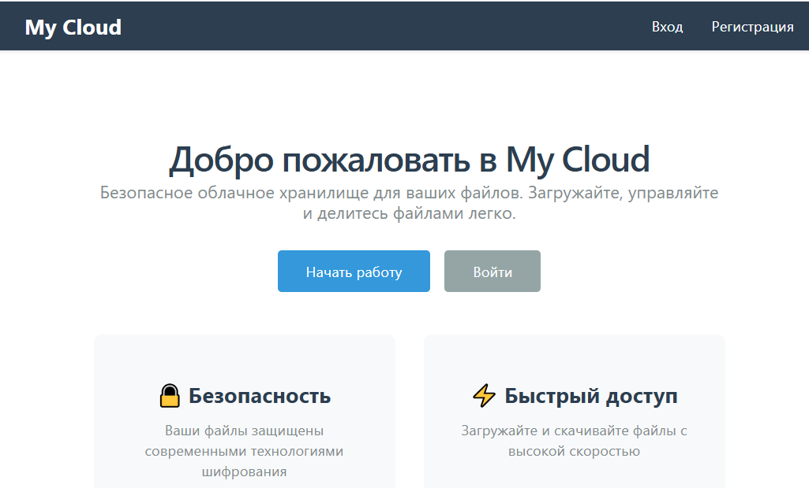
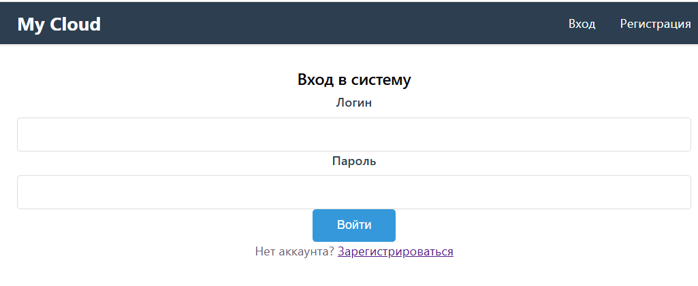
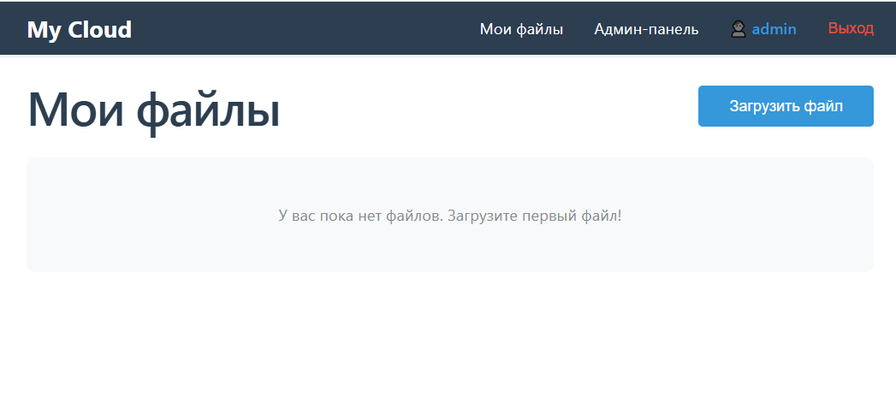
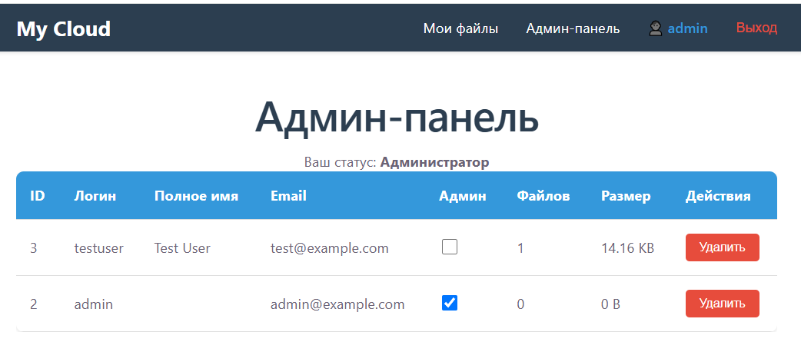

# ☁️ My Cloud — Облачное хранилище файлов

Веб-приложение для облачного хранения файлов с возможностью загрузки, скачивания, управления и обмена файлами через публичные ссылки.

## 📋 Описание проекта

**My Cloud** — это полнофункциональное SPA-приложение (Single Page Application), реализующее облачное хранилище файлов. Проект разработан в рамках дипломной работы по профессии "Fullstack-разработчик на Python".

### Основные возможности

#### Для пользователей:
- ✅ Регистрация и аутентификация с валидацией данных
- ✅ Загрузка файлов с комментариями
- ✅ Скачивание файлов с сохранением оригинальных имён
- ✅ Просмотр файлов в браузере (изображения, PDF, видео)
- ✅ Переименование файлов
- ✅ Редактирование комментариев
- ✅ Удаление файлов
- ✅ Генерация обезличенных публичных ссылок для обмена
- ✅ Публичное скачивание без авторизации

#### Для администраторов:
- ✅ Просмотр списка всех пользователей
- ✅ Управление правами администратора
- ✅ Удаление пользователей
- ✅ Просмотр файлов любого пользователя
- ✅ Информация о количестве и размере файлов пользователей

## 🛠️ Технологии

### Backend
- **Python 3.10+**
- **Django 4.2** — веб-фреймворк
- **Django REST Framework 3.14** — REST API
- **PostgreSQL** — СУБД
- **WhiteNoise** — отдача статических файлов
- **django-cors-headers** — CORS для SPA

### Frontend
- **React 18** — UI библиотека
- **Redux Toolkit** — управление состоянием
- **React Router 6** — маршрутизация
- **Axios** — HTTP клиент
- **Vite** — сборщик

### Инфраструктура
- **Nginx** — веб-сервер (для продакшена)
- **Gunicorn** — WSGI сервер (для продакшена)
- **Git** — система контроля версий

## 📁 Структура проекта

mycloud/

├── backend/ # Django приложение

│ ├── manage.py # Управление проектом

│ ├── requirements.txt # Зависимости Python

│ ├── .env # Переменные окружения (не в git)

│ ├── my_cloud/ # Настройки проекта

│ │ ├── settings.py

│ │ ├── urls.py

│ │ ├── wsgi.py

│ │ └── exceptions.py # Кастомный обработчик ошибок

│ ├── users/ # Приложение пользователей

│ │ ├── models.py # Модель User

│ │ ├── serializers.py # Сериализаторы

│ │ ├── views.py # API views

│ │ ├── permissions.py # Проверка прав

│ │ └── urls.py # Маршруты

│ ├── files/ # Приложение файлов

│ │ ├── models.py # Модель File

│ │ ├── serializers.py # Сериализаторы

│ │ ├── views.py # API views

│ │ ├── permissions.py # Проверка прав

│ │ └── urls.py # Маршруты

│ ├── media_storage/ # Хранилище файлов (не в git)

│ └── staticfiles/ # Собранные статики (не в git)

│

├── frontend/ # React приложение

│ ├── package.json # Зависимости Node.js

│ ├── vite.config.js # Конфигурация Vite

│ ├── src/

│ │ ├── api/ # API клиент (Axios)

│ │ ├── components/ # Используемые компоненты

│ │ ├── pages/ # Страницы (Home, Login, Register, Dashboard, Admin)

│ │ ├── store/ # Redux store и slices

│ │ ├── App.jsx # Корневой компонент

│ │ └── main.jsx # Точка входа

│

└── README.md # Этот файл

## 🚀 Локальная установка (разработка)

### Предварительные требования

- Python 3.10 или выше
- Node.js 18 или выше
- PostgreSQL 12 или выше
- Git

### 1. Клонирование репозитория

```bash
git clone https://github.com/danroman-github/mycloud.git
cd mycloud
```

### 2. Настройка Backend

#### 2.1. Создание виртуального окружения

```bash
cd backend
python -m venv venv

# Windows:
venv\Scripts\activate

# Linux/Mac:
source venv/bin/activate
```

#### 2.2. Установка зависимостей

```bash
pip install -r requirements.txt
```

#### 2.3. Настройка базы данных PostgreSQL

Создайте базу данных и пользователя:

```sql
-- Войдите в PostgreSQL
psql -U postgres

-- Создайте базу данных
CREATE DATABASE my_cloud_db;

-- Создайте пользователя (опционально, можно использовать postgres)
CREATE USER mycloud_user WITH PASSWORD 'ваш_пароль';
GRANT ALL PRIVILEGES ON DATABASE my_cloud_db TO mycloud_user;

-- Выйдите
\q
```

#### 2.4. Настройка переменных окружения

Создайте файл backend/.env:

```end
# Django settings
DEBUG=False
DJANGO_SECRET_KEY=ваш-секретный-ключ-минимум-50-символов

# List of allowed hosts
ALLOWED_HOSTS=185-20-227-198.cloudvps.regruhosting.ru,localhost,127.0.0.1

# List of trusted sources for CSRF tokens
CSRF_TRUSTED_ORIGINS=http://185-20-227-198.cloudvps.regruhosting.ru

# Database
DB_NAME=my_cloud_db
DB_USER=postgres
DB_PASSWORD=postgres
DB_HOST=localhost
DB_PORT=5432

# Media storage
MEDIA_STORAGE_ROOT=C:/путь/к/mycloud/backend/media_storage

# Logging
DJANGO_LOG_LEVEL=INFO
```

⚠️ Важно: Замените MEDIA_STORAGE_ROOT на реальный путь к папке на вашем компьютере. Используйте прямые слеши /.

#### 2.5. Применение миграций

```bash
python manage.py makemigrations
python manage.py migrate
```

#### 2.6. Создание суперпользователя (администратора)

```bash
python manage.py createsuperuser
```
Введите данные:
Username: admin (или другой логин, начинающийся с буквы)
Full name: Администратор Системы
Email: admin@example.com
Password: Admin123! (минимум 6 символов, заглавная буква, цифра, спецсимвол)

#### 2.7. Установка прав администратора

```bash
python manage.py shell
```

```python
from users.models import User
admin_user = User.objects.get(username='admin')
admin_user.is_admin = True
admin_user.save()
exit()
```

#### 2.8. Сбор статических файлов

```bash
python manage.py collectstatic
```

#### 2.9. Запуск сервера разработки

```bash
python manage.py runserver
```

Backend доступен по адресу: http://127.0.0.1:8000

### 3. Настройка Frontend

#### 3.1. Установка зависимостей

Откройте новый терминал и выполните:

```bash
cd frontend
npm install
```

#### 3.2. Запуск сервера разработки

```bash
npm run dev
```

Frontend доступен по адресу: http://localhost:5173

#### 4. Проверка работы

1. Откройте http://localhost:5173
2. Зарегистрируйте нового пользователя или войдите как admin
3. Загрузите тестовый файл
4. Проверьте все функции

### 📡 API Endpoints

#### Аутентификация

| Описание | Метод	| Endpoint |
|---|---|---|
| Получить CSRF токен | GET | /api/auth/csrf/ |
| Регистрация | POST | /api/auth/register/ |
| Вход | POST | /api/auth/login/ |
| Выход | POST | /api/auth/logout/ |
| Текущий пользователь | GET | /api/auth/me/ |

#### Управление пользователями (только для админов)

| Описание | Метод	| Endpoint |
|---|---|---|
| Список пользователей | GET | /api/auth/admin/users/ |
| Детали пользователя | GET | /api/auth/admin/users/{id}/ |
| Обновить пользователя | PATCH | /api/auth/admin/users/{id}/ |
| Удалить пользователя | DELETE | /api/auth/admin/users/{id}/ |

#### Файлы

| Описание | Метод	| Endpoint |
|---|---|---|
| Список файлов | GET | /api/files/ |
| Загрузить файл | POST | /api/files/upload/ |
| Детали файла | GET | /api/files/{id}/ |
| Обновить комментарий | PATCH | /api/files/{id}/ |
| Переименовать | PUT | /api/files/{id}/rename/ |
| Удалить файл | DELETE | /api/files/{id}/ |
| Скачать файл | GET | /api/files/{id}/download/ |
| /api/files/{id}/download/?view=1
| Просмотр в браузере | GET | /api/files/{id}/download/?view=1 |
| Сгенерировать публичную ссылку | POST | /api/files/{id}/share/ |

#### Публичный доступ

| Описание | Метод	| Endpoint |
|---|---|---|
| Скачать по публичной ссылке | GET | /api/public/files/{uuid}/download/ |
| /api/public/files/{uuid}/view/
| Просмотр по публичной ссылке | GET | /api/public/files/{uuid}/view/ |

### 🔐 Требования к данным

#### Регистрация

- Логин: 4-20 символов, начинается с буквы, только латиница и цифры
- Email: корректный формат email
- Пароль: минимум 6 символов, хотя бы одна заглавная буква, цифра и спецсимвол

#### Файлы

Максимальный размер: не ограничен (зависит от настроек сервера)
Поддерживаемые форматы: любые
Оригинальные имена сохраняются в БД
На диске файлы хранятся с UUID-именами для избежания конфликтов

### 🌐 Production-развертывание

#### 1. Подготовка сервера (Ubuntu)

Установите Python, Pip, Nginx, PostgreSQL и Gunicorn. Клонируйте репозиторий.

#### 2. Настройка .env для Production

Файл backend/.env должен содержать следующие параметры:

```ini
DEBUG=False
DJANGO_SECRET_KEY=<сгенерируйте_новый_ключ>_python_-c_"from_django.core.management.utils_import_get_random_secret_key;_print(get_random_secret_key())"

# Укажите ваш домен и IP сервера
ALLOWED_HOSTS=mycloud.example.com,185.20.227.198,localhost,127.0.0.1

# Укажите полные URL с протоколом (http или https)
CSRF_TRUSTED_ORIGINS=https://mycloud.example.com,http://185.20.227.198

# Настройки БД продакшена
DB_NAME=my_cloud_prod
DB_USER=prod_user
DB_PASSWORD=<сложный_пароль>
DB_HOST=localhost
DB_PORT=5432

MEDIA_STORAGE_ROOT=/home/mycloud/mycloud/backend/media_storage
```

#### 3. Сборка и запуск

```bash
# Сборка фронтенда
cd frontend && npm run build
cp -r dist/* ../backend/static/frontend/
cp dist/index.html ../backend/templates/

# Сборка статики Django
cd ../backend
source venv/bin/activate
python manage.py collectstatic --noinput

# Запуск через Gunicorn + Nginx
sudo systemctl start mycloud
sudo systemctl restart nginx
```

### 📸 Скриншоты

#### Главная страница



#### Страница входа



#### Управление файлами



#### Админ-панель



### 👨‍💻 Автор

#### Данилов Роман

Email: danroman@yandex.ru

GitHub: https://github.com/danroman-github

### 📄 Лицензия

Этот проект создан в образовательных целях.

### 🎓 Дипломный проект

Проект разработан в рамках обучения по профессии "Fullstack-разработчик на Python".
